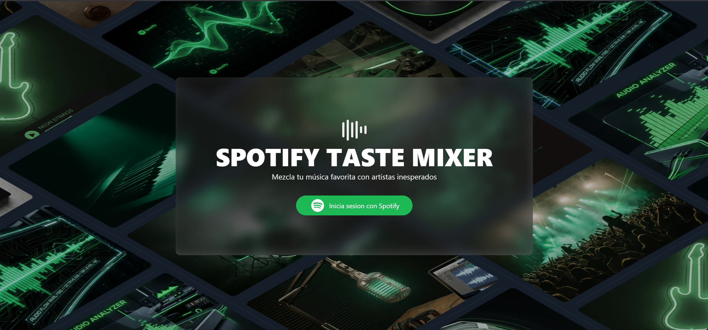
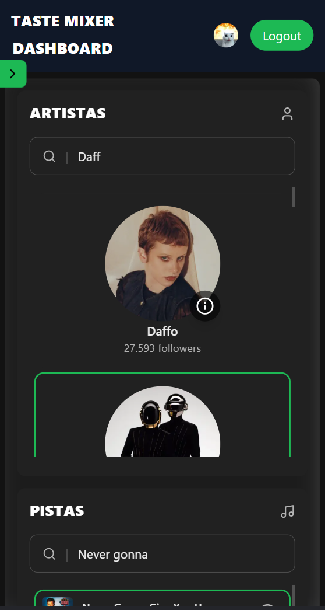
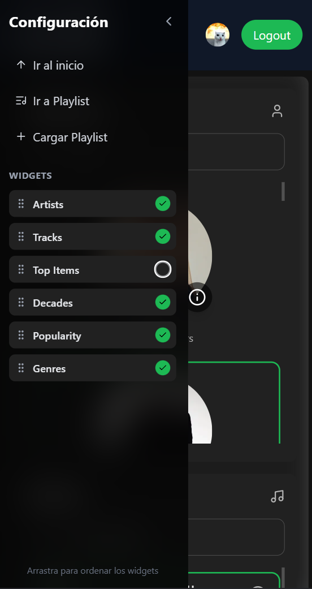
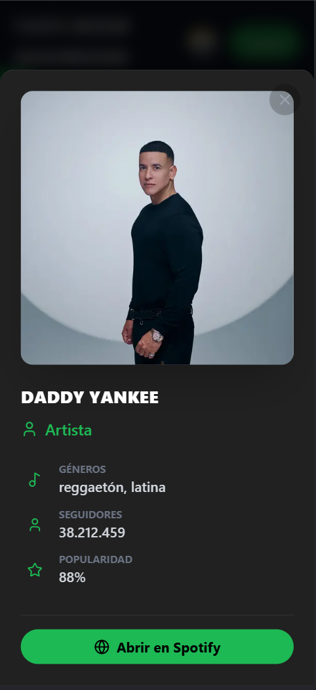
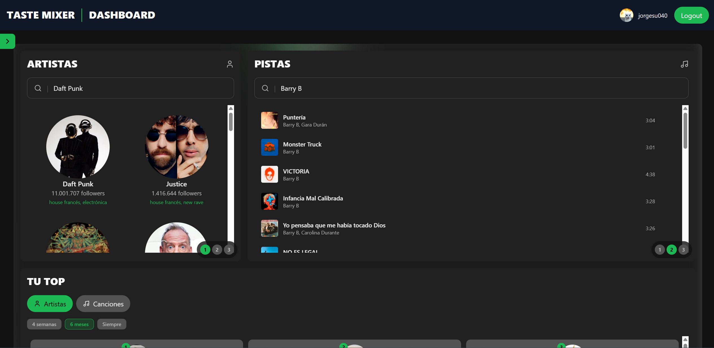
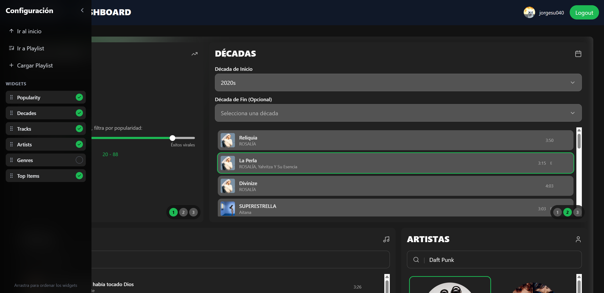
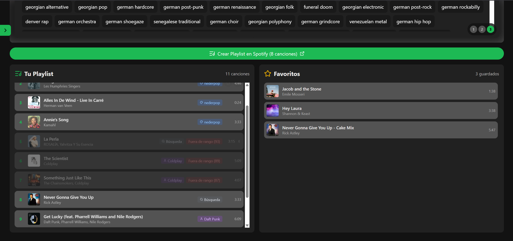
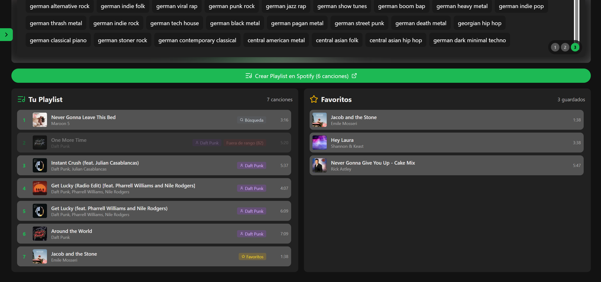
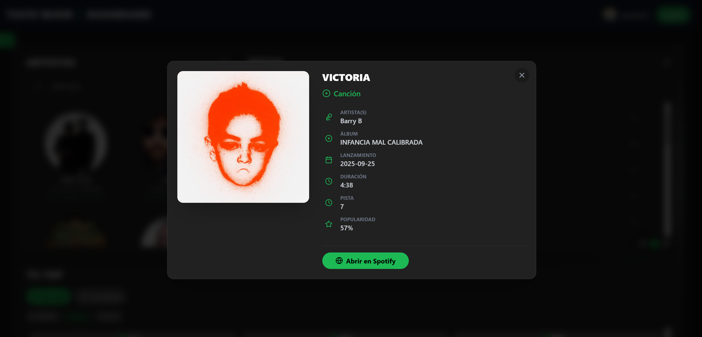
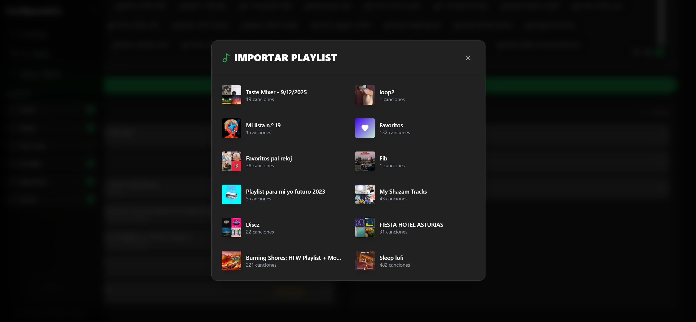

# Spotify Taste Mixer

## Resumen del proyecto

**Spotify Taste Mixer** es una aplicación web desarrollada con **Next.js (App Router)** que autentica al usuario con Spotify y le permite construir una mezcla de canciones personalizada mediante **widgets interactivos**. La playlist resultante se compone mediante un enfoque de **agregación por fuentes** (p. ej. top tracks de artistas, búsqueda por género o por rango de años), evitando depender del endpoint `/recommendations` que está deprecado desde noviembre del 2024.

**Objetivo:** ofrecer una experiencia de descubrimiento musical en la que el usuario controla de forma granular los “ingredientes” (artistas, pistas, géneros, décadas y top personal), manteniendo persistencia local de favoritos y configuración de widgets.

## Tabla de contenidos

- [Características principales](#características-principales)
- [Requisitos](#requisitos)
- [Instalación](#instalación)
- [Uso](#uso)
- [Galería de imágenes](#galería-de-imágenes)
- [API / Endpoints](#api--endpoints)
- [Estructura del proyecto](#estructura-del-proyecto)
- [Decisiones de diseño](#decisiones-de-diseño)
- [Cumplimiento de requisitos](#cumplimiento-de-requisitos)
- [Metadatos de verificación](#metadatos-de-verificación)
- [Limitaciones conocidas](#limitaciones-conocidas)
- [Licencia](#licencia)
- [Autor](#autor--créditos)
- [Checklist final](#checklist-final)

## Características principales

### Autenticación robusta

- **OAuth 2.0 (Authorization Code)** con Spotify.
- **Seguridad anti-CSRF** mediante parámetro `state`:
  - generación + persistencia temporal,
  - validación en callback,
  - limpieza del `state` tras validación.
- **Renovación automática del token**:
  - endpoint interno `POST /api/refresh-token`,
  - refresco automático ante expiración o `401` en el wrapper de Spotify.

**Archivos clave:**

- [src/lib/auth.js](src/lib/auth.js)
- [src/app/auth/callback/page.js](src/app/auth/callback/page.js)
- [src/app/api/spotify-token/route.js](src/app/api/spotify-token/route.js)
- [src/app/api/refresh-token/route.js](src/app/api/refresh-token/route.js)
- [src/lib/spotifyFetch.js](src/lib/spotifyFetch.js)

### Sistema de widgets (configurable)

En [/dashboard](src/app/dashboard) existe un grid de widgets con:

- **Reordenación mediante drag & drop** de widgets (sidebar).
- **Activar/desactivar widgets** (sidebar).
- **Persistencia de configuración** (orden/visibilidad y ancho de columnas) en `localStorage`.

**Archivos clave:**

- [src/hooks/useWidgetManager.js](src/hooks/useWidgetManager.js)
- [src/components/Sidebar.jsx](src/components/Sidebar.jsx)
- [src/components/WidgetWrapper.jsx](src/components/WidgetWrapper.jsx)

### Widgets implementados

- **Artist Widget**: búsqueda de artistas y selección (límite configurable). Al seleccionar artistas se agregan automáticamente top tracks del artista.
  - [src/components/widgets/ArtistWidget.jsx](src/components/widgets/ArtistWidget.jsx)
  - [src/lib/spotifyFetch.js](src/lib/spotifyFetch.js) ([fetchSearchArtist](src/lib/spotifyFetch.js), [fetchArtistTopTracks](src/lib/spotifyFetch.js))
  - [src/hooks/usePlaylistContext.jsx](src/hooks/usePlaylistContext.jsx) ([handleArtistSelect](src/hooks/usePlaylistContext.jsx:12:2-45:3))
- **Track Widget**: búsqueda de pistas y selección múltiple.
  - [src/components/widgets/TrackWidget.jsx](src/components/widgets/TrackWidget.jsx)
- **Genre Widget**: búsqueda difusa con Fuse.js sobre un catálogo local (`generes.json`) y agregación de tracks por género.
  - [src/components/widgets/GenreWidget.jsx](src/components/widgets/GenreWidget.jsx)
  - `src/generes/generes.json`
  - [src/lib/spotifyFetch.js](src/lib/spotifyFetch.js) ([fetchTopTracksByGenre](src/lib/spotifyFetch.js))
  - Nota: el catálogo de géneros se mantiene local porque el endpoint de seeds de géneros de Spotify (`/recommendations/available-genre-seeds`) está deprecado/no disponible. Por ello usamos un catálogo externo actualizado (ver créditos) y heurísticas/búsquedas en la API pública para obtener tracks por género; créditos en [CREDITS.md]
- **Decade Widget**: búsqueda por rango de años usando `year:AAAA-BBBB` y selección de tracks.
  - [src/components/widgets/DecadeWidget.jsx](src/components/widgets/DecadeWidget.jsx)
  - [src/lib/spotifyFetch.js](src/lib/spotifyFetch.js) ([fetchSearchTracksByYear](src/lib/spotifyFetch.js))
- **Top Widget**: top artistas y top tracks del usuario según rango temporal (4 semanas, 6 meses, siempre).
  - [src/components/widgets/TopWidget.jsx](src/components/widgets/TopWidget.jsx)
  - [src/lib/spotifyFetch.js](src/lib/spotifyFetch.js) ([fetchUserTopArtists](src/lib/spotifyFetch.js), [fetchUserTopTracks](src/lib/spotifyFetch.js))
- **Popularity Widget**: slider 0–100 para filtrar de manera interactiva el resultado.
  - [src/components/widgets/PopularityWidget.jsx](src/components/widgets/PopularityWidget.jsx)
  - [src/hooks/useFilter.jsx](src/hooks/useFilter.jsx)

### Gestión de playlist y extras destacables

- **Eliminar tracks individualmente** desde la playlist agregada.
- **Favoritos persistentes** en `localStorage` (`favorite_tracks`) y panel independiente.
- **Importación de playlists del usuario**: permite cargar una playlist del usuario y añadir sus tracks al mezclador.
- **Exportación real a Spotify**: crea una playlist en Spotify y añade los tracks seleccionados (abre la URL resultante).

**Archivos clave:**

- [src/components/PlaylistPanel.jsx](src/components/PlaylistPanel.jsx)
- [src/components/FavoritesPanel.jsx](src/components/FavoritesPanel.jsx)
- [src/components/PlaylistSelectorModal.jsx](src/components/PlaylistSelectorModal.jsx)
- [src/lib/spotifyFetch.js](src/lib/spotifyFetch.js) ([createPlaylistWithTracks](src/lib/spotifyFetch.js), [fetchUserPlaylists](src/lib/spotifyFetch.js), [fetchPlaylistTracks](src/lib/spotifyFetch.js))

## Requisitos

### Software

- Node.js **18+**
- npm
- Cuenta de Spotify
- App creada en Spotify Developer Dashboard

### Variables de entorno

Crear [.env.local](.env.local) en la raíz del proyecto:

```bash
SPOTIFY_CLIENT_ID=tu_client_id_aqui
SPOTIFY_CLIENT_SECRET=tu_client_secret_aqui
NEXT_PUBLIC_SPOTIFY_CLIENT_ID=tu_client_id_aqui
NEXT_PUBLIC_REDIRECT_URI=http://127.0.0.1:3000/auth/callback
```

## Instalación

1) Instalar dependencias:

    ```bash
    npm install
    ```

2) Configurar Spotify Dashboard:

    - Crear app en <https://developer.spotify.com/dashboard>
    - Añadir Redirect URI:
      - `http://127.0.0.1:3000/auth/callback`

3) Ejecutar en desarrollo:

    ```bash
    npm run dev
    ```

4) Abrir:

    - `http://127.0.0.1:3000`

## Uso

### Flujo principal

1) Ir a `/` y pulsar **“Inicia sesión con Spotify”**.
2) Completar autorización en Spotify.
3) El callback (`/auth/callback`) valida `state`, intercambia `code` por tokens y redirige al dashboard.
4) En [/dashboard](src/app/dashboard):

    - Seleccionar artistas, géneros, tracks o décadas para poblar “Tu Playlist”.
    - Busca entre tu top de canciones y artistas para añadir canciones que te encantan
    - Marcar tracks como favoritos y comprobar persistencia tras recargar.
    - Eliminar, si quieres tracks individualmente.
    - Si quieres mezcalar playlists, puedes importar una playlist desde la sidebar (botón “Cargar Playlist”).
    - Exportar la playlist filtrada por popularidad a Spotify con “Crear Playlist en Spotify”.

## Galería de imágenes

### Interfaz y autenticación

  
_Página de inicio ([src/app/page.js](src/app/page.js)) con botón de login y fondo visual._

### Diseño Responsive (Móvil)

<div style="display: flex; gap: 10px; flex-wrap: wrap;">
  
  
  
</div>
    
_La interfaz se adapta a pantallas pequeñas mediante un sidebar colapsable y controles táctiles._

### Dashboard y widgets

  
_Grid de widgets y disposición responsive ([src/app/dashboard/page.js](src/app/dashboard/page.js))._

  
_Sidebar con reordenación/activación de widgets e importación de playlist ([src/components/Sidebar.jsx](src/components/Sidebar.jsx))._

### Playlist y favoritos

  
_Panel “Tu Playlist” con eliminación y marcado de favoritos ([src/components/PlaylistPanel.jsx](src/components/PlaylistPanel.jsx))._

  
_Vista completa del panel de Playlist y Favoritos en escritorio._

### Informacion detallada

  
_Modal con información detallada de la canción y enlace a Spotify ([src/components/InfoModal.jsx](src/components/InfoModal.jsx))._

### Importación y exportación

  
_Modal para importar playlists del usuario ([src/components/PlaylistSelectorModal.jsx](src/components/PlaylistSelectorModal.jsx))._

## API / Endpoints

### Endpoints internos (Next.js API Routes)

- **`POST /api/spotify-token`**
  - **Archivo:** [src/app/api/spotify-token/route.js](src/app/api/spotify-token/route.js)
  - **Entrada:** `{ "code": "..." }`
  - **Salida:** `{ "access_token": "...", "refresh_token": "...", "expires_in": 3600 }`
  - **Propósito:** intercambio seguro de `code` por tokens usando `client_secret` solo en servidor.

- **`POST /api/refresh-token`**
  - **Archivo:** [src/app/api/refresh-token/route.js](src/app/api/refresh-token/route.js)
  - **Entrada:** `{ "refresh_token": "..." }`
  - **Salida:** `{ "access_token": "...", "expires_in": 3600 }`
  - **Propósito:** renovar el `access_token` sin intervención del usuario.

### Externos (Spotify Web API) usados por el proyecto

Integrados en [src/lib/spotifyFetch.js](src/lib/spotifyFetch.js):

- `GET /search` (artistas, tracks, tracks por género y por año)
- `GET /artists/{id}/top-tracks`
- `GET /me`
- `GET /me/top/artists`, `GET /me/top/tracks`
- `GET /me/playlists`
- `GET /playlists/{playlist_id}/tracks`
- `POST /users/{user_id}/playlists`
- `POST /playlists/{playlist_id}/tracks`

## Estructura del proyecto

Estructura:

```text
src/
├── app/
│   ├── api/
│   │   ├── spotify-token/route.js
│   │   └── refresh-token/route.js
│   ├── auth/callback/page.js
│   ├── dashboard/
│   │   ├── layout.js
│   │   └── page.js
│   ├── favicon.ico
│   ├── globals.css
│   ├── layout.js
│   └── page.js
├── components/
│   ├── CursorBlob.jsx
│   ├── FavoritesPanel.jsx
│   ├── Header.jsx
│   ├── InfoButton.jsx
│   ├── InfoModal.jsx
│   ├── PlaylistDisplay.jsx
│   ├── PlaylistPanel.jsx
│   ├── PlaylistSelectorModal.jsx
│   ├── SearchBar.jsx
│   ├── Sidebar.jsx
│   ├── SpotifyBtn.jsx
│   ├── SpotifyBtnLogin.jsx
│   ├── TextSpanWrapper.jsx
│   ├── WidgetLimitPopup.jsx
│   ├── WidgetWrapper.jsx
│   ├── ui/
│   │   └── loading-spinner.jsx
│   └── widgets/
│       ├── items/
│       │   ├── ArtistItem.jsx
│       │   ├── DecadeItem.jsx
│       │   ├── GenreItem.jsx
│       │   ├── PlaylistItem.jsx
│       │   └── TrackItem.jsx
│       ├── ArtistWidget.jsx
│       ├── DecadeWidget.jsx
│       ├── GenreWidget.jsx
│       ├── MoodWidget.jsx
│       ├── PopularityWidget.jsx
│       ├── TopWidget.jsx
│       └── TrackWidget.jsx
├── generes/
│   ├── CREDITS.md
│   └── generes.json
├── hooks/
│   ├── usePlaylistContext.jsx
│   ├── useWidgetManager.js
│   └── useFilter.jsx
└── lib/
    ├── auth.js
    ├── spotifyFetch.js
    └── spotify.js
```

## Decisiones de diseño

1) **Agregación vs recomendación**: como  `/recommendations` está deprecado, se adopta un modelo determinista donde el usuario ve exactamente qué se añade al seleccionar fuentes (artistas, géneros, décadas, top personal).
2) **Seguridad**: el `client_secret` no se expone al cliente. El intercambio/refresh ocurre en API Routes (`src/app/api/*`).
3) **Persistencia híbrida**:
    - Tokens OAuth en `localStorage` (con expiración y refresh).
    - Favoritos y configuración de widgets en `localStorage`.

4) **Debounce en búsquedas**: para evitar llamadas excesivas, [SearchBar](src/components/SearchBar.jsx) implementa debounce (por defecto `300ms`).

## Cumplimiento de requisitos


### Requisitos obligatorios (según [Enunciado.md](Enunciado.md))

- **R1 — OAuth 2.0 authentication flow**
  - **Estado:** ok
  - **Archivos:** [src/lib/auth.js](src/lib/auth.js), [src/app/auth/callback/page.js](src/app/auth/callback/page.js), [src/app/api/spotify-token/route.js](src/app/api/spotify-token/route.js)
  - **Verificación:** `npm run dev` → login real → redirección a [/dashboard](src/app/dashboard).

- **R2 — Token refresh automático**
  - **Estado:** ok
  - **Archivos:** [src/app/api/refresh-token/route.js](src/app/api/refresh-token/route.js), [src/lib/spotifyFetch.js](src/lib/spotifyFetch.js)
  - **Verificación:** usar widgets que llamen a Spotify y comprobar que ante `401` intenta refrescar una vez.

- **R3 — Mínimo 3–4 widgets funcionales**
  - **Estado:** ok
  - **Archivos:** `src/components/widgets/*`, [src/app/dashboard/page.js](src/app/dashboard/page.js)
  - **Verificación:** en [/dashboard](src/app/dashboard) hay al menos Artist/Track/Genre/Decade/Top/Popularity.

- **R4 — Generación de playlist basada en widgets**
  - **Estado:** ok
  - **Archivos:** [src/hooks/usePlaylistContext.jsx](src/hooks/usePlaylistContext.jsx), [src/lib/spotifyFetch.js](src/lib/spotifyFetch.js)
  - **Verificación:** seleccionar artistas/géneros/décadas y observar adición de tracks.

- **R5 — Eliminar tracks de playlist**
  - **Estado:** ok
  - **Archivos:** [src/hooks/usePlaylistContext.jsx](src/hooks/usePlaylistContext.jsx) ([removeTrack](src/hooks/usePlaylistContext.jsx)), [src/components/PlaylistPanel.jsx](src/components/PlaylistPanel.jsx)
  - **Verificación:** añadir tracks y eliminar uno (disminuye contador).

- **R6 — Marcar tracks como favoritos (localStorage)**
  - **Estado:** ok
  - **Archivos:** [src/app/dashboard/page.js](src/app/dashboard/page.js), [src/components/FavoritesPanel.jsx](src/components/FavoritesPanel.jsx), [src/components/PlaylistPanel.jsx](src/components/PlaylistPanel.jsx)
  - **Verificación:** marcar favorito → recargar → persiste en panel “Favoritos”.

- **R7 — Añadir más canciones**
  - **Estado:** ok
  - **Cómo se cumple:** modelo aditivo en [handleArtistSelect](src/hooks/usePlaylistContext.jsx), [handleGenreSelect](src/hooks/usePlaylistContext.jsx) y [addTracksToPlaylist](src/lib/spotifyFetch.js) (deduplicación por `id`).
  - **Archivos:** [src/hooks/usePlaylistContext.jsx](src/hooks/usePlaylistContext.jsx), [src/components/PlaylistSelectorModal.jsx](src/components/PlaylistSelectorModal.jsx)
  - **Verificación:** seleccionar nuevas fuentes y comprobar que la lista aumenta sin duplicar.

- **R8 — Diseño responsive**
  - **Estado:** ok
  - **Archivos:** [src/app/page.js](src/app/page.js), [src/app/dashboard/page.js](src/app/dashboard/page.js), [src/app/globals.css](src/app/globals.css)
  - **Verificación:** inspección responsive (mobile/tablet/desktop).

### Criterios generales de widgets

- **W1 — Widget como componente independiente**
  - **Estado:** ok
  - **Archivos:** `src/components/widgets/*.jsx`

- **W2 — Props `onSelect` y `selectedItems`**
  - **Estado:** ok
  - **Archivos:** [src/components/widgets/ArtistWidget.jsx](src/components/widgets/ArtistWidget.jsx), [GenreWidget.jsx](src/components/widgets/GenreWidget.jsx), [TrackWidget.jsx](src/components/widgets/TrackWidget.jsx), [DecadeWidget.jsx](src/components/widgets/DecadeWidget.jsx)

- **W3 — Mostrar estado de carga cuando haga peticiones**
  - **Estado:**: ok
  - **Evidencia:** los flujos muestran carga (callback, modal de importación, etc).
  - **Archivos:** [src/app/auth/callback/page.js](src/app/auth/callback/page.js), [src/components/PlaylistSelectorModal.jsx](src/components/PlaylistSelectorModal.jsx), [src/components/SearchBar.jsx](src/components/SearchBar.jsx)

### Opcionales implementados como extras

- **O1 — Guardar playlist en Spotify**
  - **Estado:** ok (extra implementado)
  - **Archivos:** [src/lib/spotifyFetch.js](src/lib/spotifyFetch.js) ([createPlaylistWithTracks](src/lib/spotifyFetch.js)), [src/app/dashboard/page.js](src/app/dashboard/page.js) ([handleCreatePlaylist](src/app/dashboard/page.js))

- **O2 — Guardar preferencias de widgets**
  - **Estado:** ok (extra implementado)
  - **Archivos:** [src/hooks/useWidgetManager.js](src/hooks/useWidgetManager.js), [src/components/WidgetWrapper.jsx](src/components/WidgetWrapper.jsx)

- **O3 — Drag & drop**
  - **Estado:** ok (extra implementado)
  - **Archivos:** [src/components/Sidebar.jsx](src/components/Sidebar.jsx)

- **O4 — Preview de canciones (30s)**
  - **Nota**: desde la deprecación del endpoint `/recommendations` no se puede obtener la previsualizacion de canciones.


## Limitaciones conocidas

- **Deprecación de `/recommendations`**: se evita por diseño (según indica el enunciado).
- **MoodWidget no implementado**:
  - **Archivo:** [src/components/widgets/MoodWidget.jsx](src/components/widgets/MoodWidget.jsx)
  - Contiene notas sobre limitaciones por cambios/deprecaciones en la API.

## Licencia

- MIT

## Autor / Créditos

- **Autor:** Jorgesu040
- **API externa:** Spotify Web API
- **Tecnologías:** Next.js, React, Tailwind CSS, Headless UI, Fuse.js, @dnd-kit, Motion, Lucide React, Shadcn/ui, Aceternity UI, Animate UI

## Checklist final

- [x] OAuth 2.0 implementado (Authorization Code)
- [x] Validación anti-CSRF mediante `state`
- [x] Refresh automático de token
- [x] Mínimo 3–4 widgets funcionales (superado)
- [x] Generación de playlist basada en widgets sin `/recommendations`
- [x] Eliminar tracks individualmente
- [x] Marcar tracks como favoritos (persistencia en `localStorage`)
- [x] Añadir más canciones manteniendo las existentes (modelo aditivo)
- [x] Diseño responsive
- [x] Extras: importación de playlists y exportación/guardado real en Spotify
